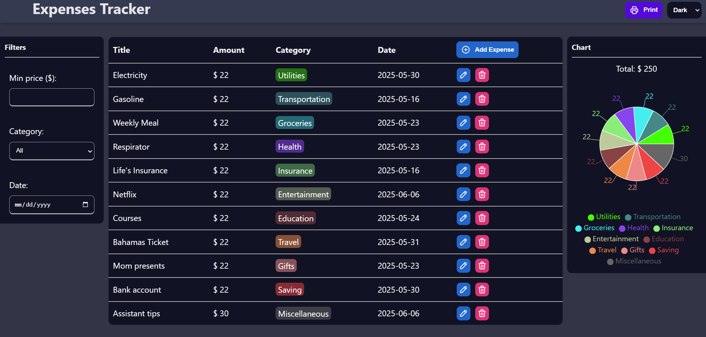
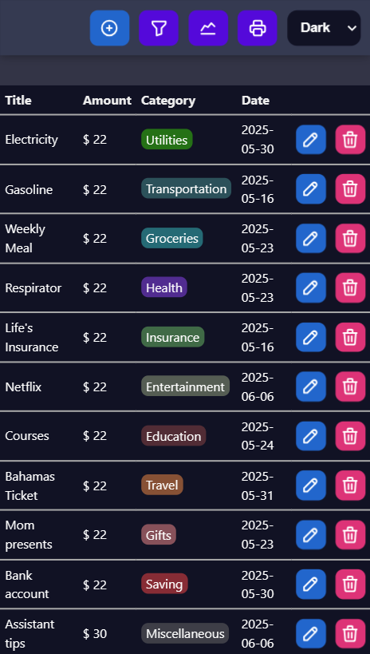

# Smart Expense Tracker

A professional, frontend-focused web application designed to help users efficiently track, categorize, analyze their expenses. Built with React, this app provides intuitive UI components, dynamic charts, and responsive design to deliver a smooth experience across devices.

## Screenshots




## Features

- Add, edit and delete expenses.
- Filter expenses by min price, category and date.
- Print expenses.
- Visualize expenses with chart (using Recharts).
- Local storage support for data persistence.
- Responsive and accessible UI.
- Performance-optimized with lazy loading and conditional rendering.
- Dark and light mode toggle.

## Tech Stack

- React + Vite.
- JavaScript (ES6+).
- CSS.
- Local Storage API.

## Setup

Clone the repository and install dependencies:

```bash
git clone https://github.com/josevigodev/smart-expenses-tracker.git
cd expenses-tracker
npm install
```

Run de app localy:

```bash
npm run dev
```

Build for production:

```bash
npm run build
```

Preview the production build:

```bash
npm run preview
```
